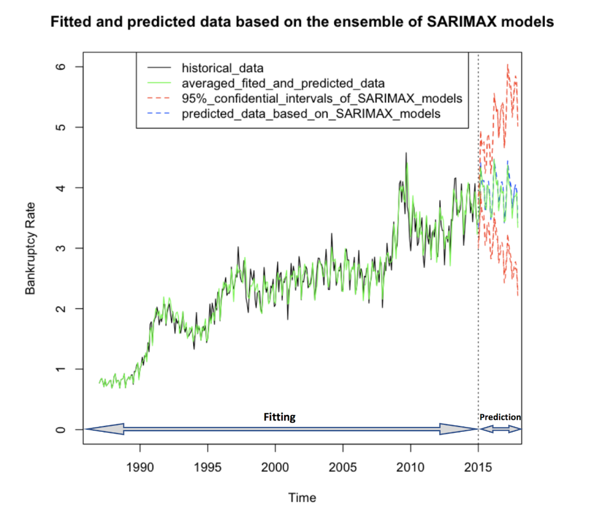

# Forecasting Canadian Bankruptcy Rate with Time Series

## Project Overview

The risk of bankruptcy is often priced into interest rates or baked into the price for insurance rate. That is why being able to predict country's national bankruptcy rate is important for many businesses.
In our project, we aim to accurately forecast monthly bankruptcy rate in Canada for the period 2015-2017.

The data for bankruptcy rate 1987-2014 was given along with corresponding data on unemployment rates, population rates, and Housing Price Index. 
 
We applied multivariate time series models (SARIMAX, VARX). The validation data is the subset data from 2011 to 2014, we used validation data to tune parameters for each model. Then we refit the model on whole data we have, made the prediction for the next 3 years (2015-2017) and compared it with the true value. We used RMSE as the loss function. 

## Final model won class competition
Our final model is an ensembled of top 10 SARIMAX models with RMSE 0.12. We were ranked top 1 among 22 teams in the class competition.

 

[Multivariate model impementation code in R](https://github.com/katjawittfoth/Bankruptcy_Rate/blob/master/Time%20Series%20Modeling.ipynb)
 
[Final Report](https://github.com/katjawittfoth/Bankruptcy_Rate/blob/master/Team1.7report.pdf)
